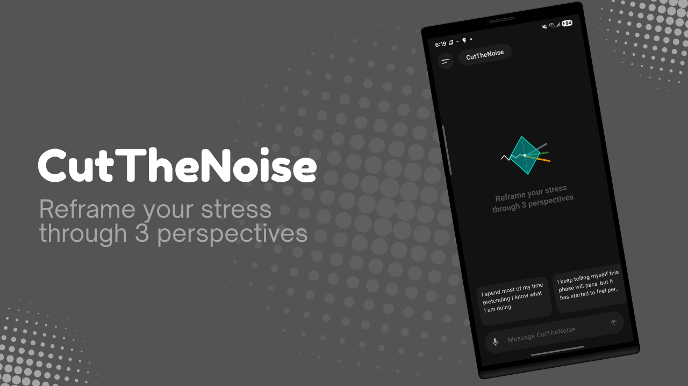
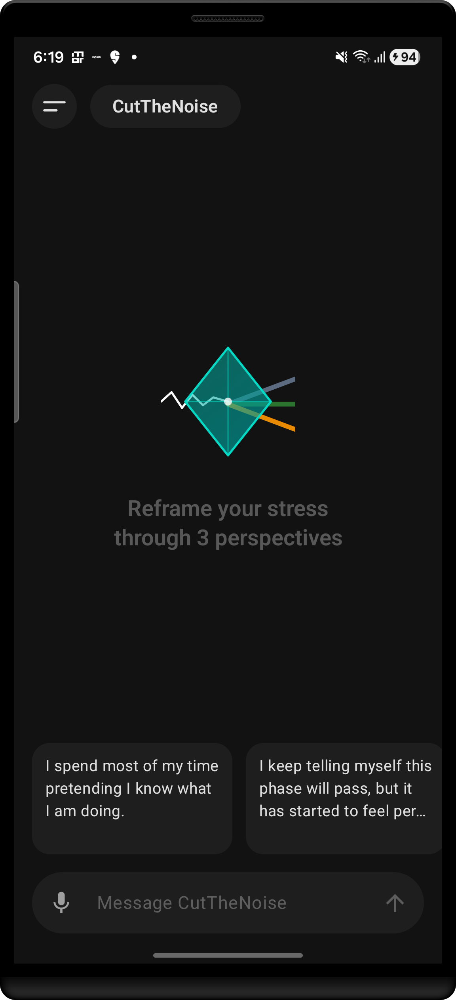
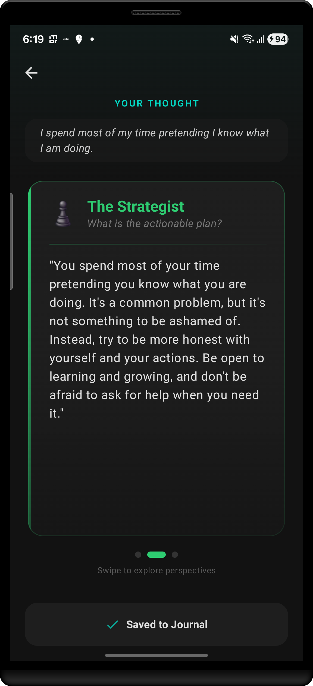
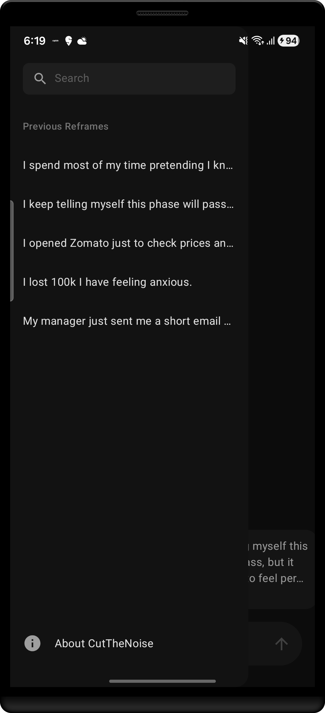

# CutTheNoise - Local LLM Android App



## What's This About?

Ever felt overwhelmed by stress and wished you had a personal coach in your pocket? That's exactly what I built here. **CutTheNoise** is a completely offline Android app that runs a local LLM (Large Language Model) right on your phone - no internet needed, no data sent to servers, just you and AI having a private conversation about your stress.

The app takes whatever's bothering you and shows it from three different angles: how a Stoic philosopher would see it, what a strategic thinker would do, and how an optimist would frame it. Pretty cool, right?

## Screenshots

<p align="center">
  
  
  
</p>

## Why Local LLM on Android?

Look, I know what you're thinking - "Why run an LLM locally when ChatGPT exists?" Here's the thing:

- **Privacy First**: Your thoughts stay on YOUR device. Period.
- **Works Offline**: No internet? No problem. Perfect for flights, remote areas, or just when you want to disconnect.
- **No API Costs**: Once it's installed, it's free forever. No subscriptions, no pay-per-use.
- **Fast**: Surprisingly quick responses, especially on modern Android devices.
- **Learning Experience**: If you're into Android development or AI, this is a goldmine for understanding how local LLM Android apps actually work.

## Tech Stack (For the Nerds)

This isn't your typical Android app. Here's what makes it tick:

- **Jetpack Compose** - Modern UI that actually looks good
- **Gemini Nano** - Google's lightweight LLM that runs on-device
- **Room Database** - Saves your reframe history locally
- **Hilt** - Dependency injection (because we're not savages)
- **Kotlin Coroutines** - Smooth async operations
- **MVVM Architecture** - Clean, testable, maintainable code
- **Material 3** - Following Google's latest design guidelines

The whole thing is built with clean architecture principles. Data layer, domain layer, presentation layer - all properly separated. Makes it easy to understand and modify.

## Features That Actually Matter

### 🎯 Three Perspective Reframing
Type in what's stressing you out, and get three different takes:
- **Stoic View**: Accept what you can't control, focus on what you can
- **Strategic View**: Break it down, find actionable steps
- **Optimistic View**: Find the silver lining and growth opportunity

### 🎤 Voice Input
Too lazy to type? Just tap the mic and talk. The app gets it.

### 💾 History & Search
All your past reframes are saved. Search through them anytime. It's like having a journal that actually helps.

### 🎨 Clean UI
Dark mode, smooth animations, and a design that doesn't hurt your eyes. Built with Jetpack Compose, so it's buttery smooth.

## How to Run This Thing

### ⚠️ IMPORTANT - Read This First!

**This app ONLY works on a REAL Android device.** Emulators won't cut it. You need actual hardware running Android 13 (API 33) or higher.

### Prerequisites
- Android Studio (latest version recommended)
- **A real Android device** running API 33+ (Android 13+)
- USB cable to connect your device
- About 750MB free space on your device (for the model file)
- A bit of patience for the first build

### Critical Step: Download the LLM Model

**The app won't work without this file!** This is the brain of the whole operation.

1. Go to [HuggingFace - TinyLlama Model](https://huggingface.co/TheBloke/TinyLlama-1.1B-Chat-v1.0-GGUF/tree/main)

2. Download the file: `tinyllama-1.1b-chat-v1.0.Q5_K_M.gguf` (it's about 500MB)

3. After cloning the project, place this file in:
   ```
   app/src/main/assets/tinyllama-1.1b-chat-v1.0.Q5_K_M.gguf
   ```

**Without this model file, the app will crash immediately.** Don't skip this step!

### Setup Steps

1. Clone this repo
```bash
git clone https://github.com/yourusername/CutTheNoise.git
```

2. **Download and add the model file** (see above - seriously, don't skip this!)

3. Open the project in Android Studio

4. Connect your real Android device via USB

5. Enable Developer Options and USB Debugging on your device

6. Let Gradle sync (grab a coffee, this might take a minute)

7. Select your device from the device dropdown

8. Hit Run

The first launch will take a bit longer as the model loads into memory. After that, it's smooth sailing.

### Troubleshooting

**App crashes on startup?**
- Did you add the model file? Check `app/src/main/assets/`
- Are you using a real device? Emulators won't work.

**Model takes forever to load?**
- First load is always slower. Be patient.
- Make sure you have enough free RAM on your device.

**Voice input not working?**
- Grant microphone permissions when prompted.

## Local LLM Android Implementation Details

If you're here to learn how to build a local LLM Android app, here's the breakdown:

The magic happens in the `LlmInferenceSource` class. We're using Google's Gemini Nano model through the Firebase AI SDK. The model gets loaded once when the app starts and stays in memory.

Key things I learned:
- Model loading takes a few seconds, so do it on app startup
- Streaming responses feel way better than waiting for the full output
- Memory management is crucial - LLMs are heavy
- Error handling is super important (models can fail to load)

Want to see how it all works? I made a full tutorial on my YouTube channel: [Simplified Coding](https://www.youtube.com/@SimplifiedCoding). Check it out if you want to build your own local LLM Android app.

## Project Structure

```
app/
├── data/           # Room database, repositories
├── domain/         # Use cases, business logic
├── presentation/   # ViewModels, UI state
├── ui/             # Compose screens, components
└── di/             # Hilt modules
```

Clean separation of concerns. Each layer only knows about the layer below it.

## Building Your Own Local LLM Android App?

Here are some tips from my experience:

1. **Start Small**: Don't try to build everything at once. Get the LLM working first, then add features.

2. **Test on Real Devices**: Emulators are fine, but real device performance is what matters.

3. **Handle Errors Gracefully**: LLMs can be unpredictable. Always have fallbacks.

4. **Optimize Memory**: Monitor your app's memory usage. LLMs are hungry.

5. **User Experience**: Streaming responses > waiting for complete output. Always.

## Contributing

Found a bug? Have an idea? PRs are welcome! Just keep the code clean and follow the existing architecture.

## License

MIT License - do whatever you want with this code. Build something cool and let me know!

## Connect

- YouTube: [Simplified Coding](https://www.youtube.com/@SimplifiedCoding)
- Questions? Open an issue, I'll try to help

---

Built with ☕ and a lot of trial and error. If this helped you learn something about local LLM Android development, give it a star ⭐
